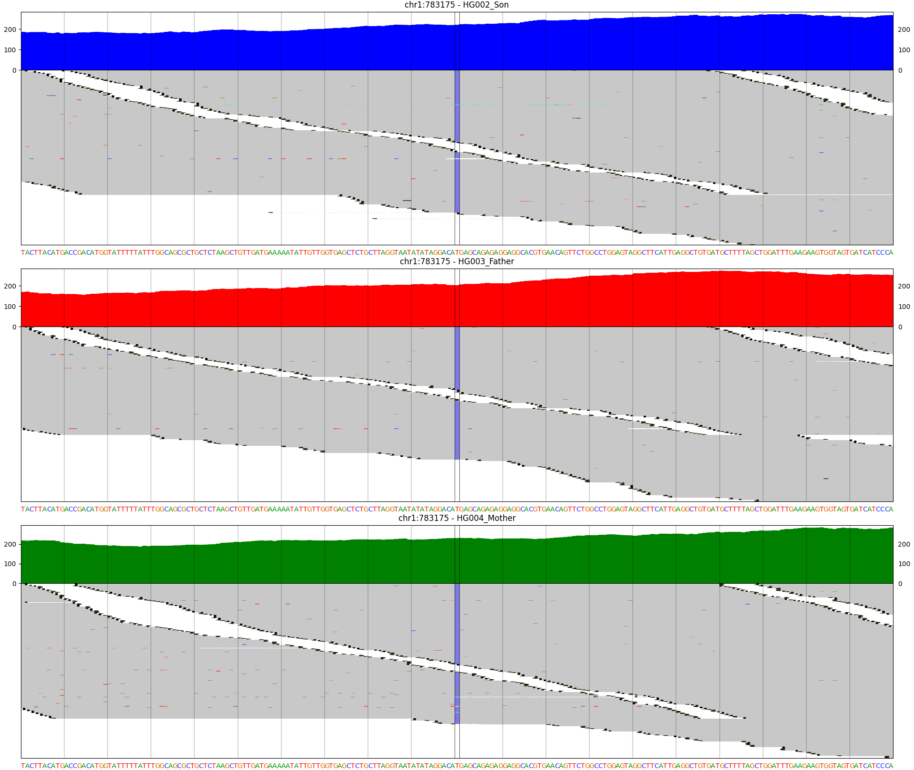

# smvplot
smvplot is a cmd line python tool to generate IGV-like screenshots.

### Install
 - Clone the repository
  ```
  git clone https://github.com/NagaComBio/smvplot.git
  ```
 - Use pip to install the local copy
  ```
  cd smvplot
  pip install .
  ```
 - Soon the package will be available via proper pip channel

### Usage
```
$ smvplot --help
usage: smvplot [-h] --bam_paths FILE --bam_names STR --ref FILE [--exclude_flag INT] [--map_quality INT] [--vcf FILE] [--bed FILE] [--annotations FILE] [--prefix PREFIX] [--window N] [--samtoolsbin N] [--tabixbin N]
               [--plot_dir DIR]
               [region]

This script generates a png file for each entry in a vcf file, a bed file or a manually specified region.

positional arguments:
  region              syntax either 'chr:start-end' or 'chr:center', use --vcf or --bed for more convenience

optional arguments:
  -h, --help          show this help message and exit
  --bam_paths FILE    input list of bam files separated by comma. Maximum 3 BAM files
  --bam_names STR     input list of names separated by comma. Same length as BAM files
  --ref FILE          input reference genome file (fastq format)
  --exclude_flag INT  Exclude the reads with corresponding SAM flags, [default = 3840]
  --map_quality INT   Minimum mapping quality for the reads, [default = 20]
  --vcf FILE          input vcf file ( as an alternative use --bed )
  --bed FILE          input bed file ( as an alternative use --vcf )
  --annotations FILE  annotation track indexed with tabix
  --prefix PREFIX     target directory and file name prefix for generated output files
  --window N          the output file for position X will show the region [X-window,X+window], [default = 100]
  --samtoolsbin N     the path to the samtools binary, [default = samtools]
  --tabixbin N        the path to the tabix binary, [default = tabix]
  --plot_dir DIR      subfolder for the pdf plots
  --out_format STR    Output format of the plot, [default = pdf]
```

### Example plots
On the GIAB samples

1. For a single variant from a single BAM
```
smvplot 
  --bam_paths HG001_merged.mdup.bam \
  --bam_names HG001 \
  --ref GRCh38_decoy_ebv_phiX_alt_hla_chr.fa \
  --plot_dir ~/smvplot_test \
  --prefix giab_HG001 \
  --out_format png
  chr1:3339544
```


2. For a single variant from a TRIO (3 BAMs)

```
smvplot \
  --bam_paths HG002_merged.mdup.bam,HG003_merged.mdup.bam,HG004_merged.mdup.bam \
  --bam_names HG002_Son,HG003_Father,HG004_Mother \
  --ref GRCh38_decoy_ebv_phiX_alt_hla_chr.fa \
  --plot_dir ~/smvplot_test \
  --prefix giab_HG00234 \
  --out_format png \
  chr1:783175
```


3. For multiple variants from a VCF/BED file

```
smvplot \
  --bam_paths HG002_merged.mdup.bam,HG003_merged.mdup.bam,HG004_merged.mdup.bam \
  --bam_names HG002_Son,HG003_Father,HG004_Mother \
  --ref GRCh38_decoy_ebv_phiX_alt_hla_chr.fa \
  --plot_dir ~/smvplot_test \
  --prefix giab_HG00234 \
  --out_format png \
  --vcf giab_benchmark_variants.vcf # --bed giab_benchmark_variants.vcf
```

### Acknowledgements
The `visualize.py` was originally written for the [DKFZ somatic indel workflow](https://github.com/DKFZ-ODCF/IndelCallingWorkflow) by Philip Ginsbach and Ivo Buchhalter. Here I have updated script to a python package and added a possibility of a third BAM and a RNAseq BAM file. And also generalized the BAM inputs.